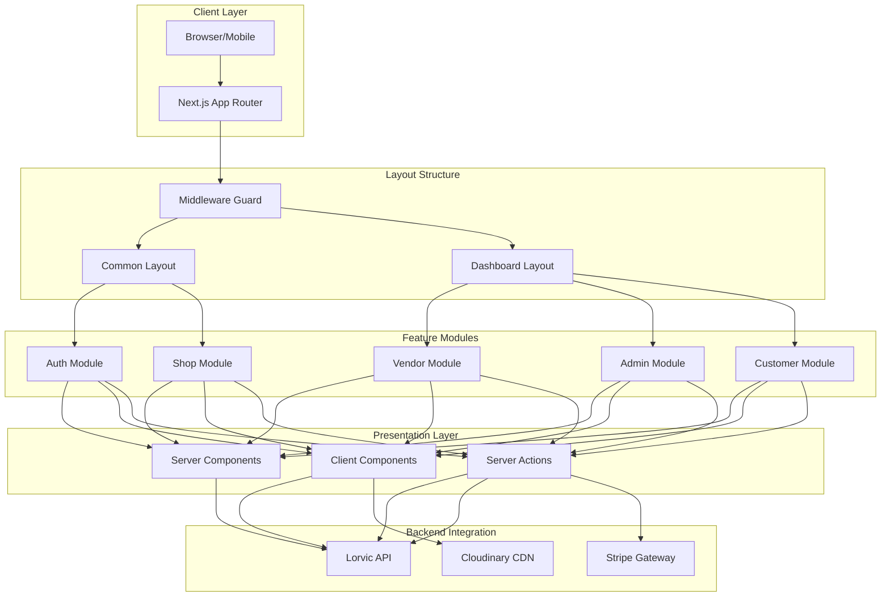
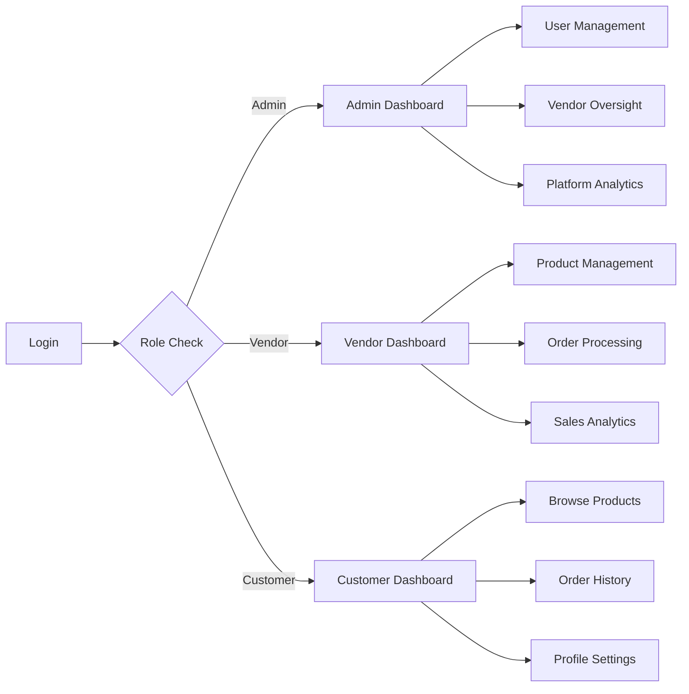
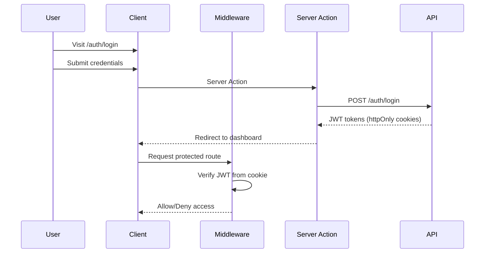

<div align="center">
  
</div>

<div align="center">
  <h2>
    
    Production-Ready Multi-Vendor E-Commerce Frontend
  </h2>
  <p><strong>Crafted for performance, built for scale</strong></p>
  <p><strong>Lorvic Client</strong> is a modern, type-safe frontend application for multi-vendor e-commerce platforms. Built with Next.js 16 App Router, React Server Components, and cutting-edge web technologies, it delivers a seamless shopping experience with role-based dashboards, secure authentication, and optimized performance.</p>
</div>

<div align="center">
    
  [](https://github.com/zahid-official/milestone-18-client)
  [](https://nextjs.org)
  [](https://react.dev/)
  [](https://www.typescriptlang.org/)
  [](https://tailwindcss.com/)
</div>

<div align="center">
    
  [](https://vercel.com)
  [](https://www.radix-ui.com/)
  [](LICENSE)
  [](https://github.com/zahid-official/milestone-18-client/pulls)
</div>

## ✨ Features

<table align="center">
  <tr>
    <td width="50%">
      
### 🎨 Modern User Experience
- **Server Components Architecture** for optimal performance
- **Role-Based Dashboards** (Admin, Vendor, Customer)
- **Responsive Design** with mobile-first approach
- **Dark/Light Theme** support with system preferences
- **Real-time Notifications** using Sonner toast
      
### 🛍️ Shopping Experience
- **Product Discovery** with advanced filtering
- **Category Navigation** with dynamic routing
- **Product Details** with image galleries
- **Shopping Cart** with real-time updates
- **Secure Checkout** via Stripe integration
      
    </td>
    <td width="50%">
      
### 🔐 Security & Authentication
- **JWT-based Auth** with httpOnly cookies
- **Route Protection** with middleware guards
- **Role-based Access** control at edge
- **Secure Forms** with server-side validation
- **CSRF Protection** for all mutations
      
### 🚀 Performance & SEO
- **Server-Side Rendering** for critical pages
- **Static Generation** for marketing content
- **Image Optimization** with Next.js Image
- **Code Splitting** for optimal bundle size
- **SEO-friendly** meta tags and structured data
      
    </td>
  </tr>
</table>

</br>

## 🗺️ Application Architecture



<div align="center">
    
| Design Principle              | Description                                                           |
| ----------------------------- | --------------------------------------------------------------------- |
| **🎯 Component-Driven**       | Reusable UI components with consistent design system                  |
| **📈 Scalable Architecture**  | Modular structure supporting feature growth                           |
| **🔒 Security-First**         | Edge-level protection with middleware guards                          |
| **⚡ Performance Optimized**  | Server components, code splitting, and image optimization             |
| **📊 Type-Safe**              | End-to-end TypeScript with Zod validation                            |
</div>

## 🛠️ **Tech Stack**

<div align="center">
    
### **Core Technologies**

<table>
  <tr>
    <td align="center" width="120">
      
      <br />Next.js 16
    </td>
    <td align="center" width="100">
      
      <br />React 19
    </td>
    <td align="center" width="100">
      
      <br />TypeScript
    </td>
    <td align="center" width="100">
      
      <br />Tailwind 4
    </td>
    <td align="center" width="120">
      
      <br />Vercel
    </td>
  </tr>
</table>

### **UI & Component Libraries**

| Category             | Technologies                     | Purpose                         |
| :------------------- | :------------------------------- | :------------------------------ |
| 🎨 **UI Primitives** | `Radix UI` `Shadcn/UI`           | Accessible component primitives |
| 🎭 **Styling**       | `Tailwind CSS 4` `CSS Variables` | Utility-first styling system    |
| 🔔 **Notifications** | `Sonner`                         | Toast notifications             |
| 🎠 **Carousel**      | `Embla Carousel`                 | Touch-enabled sliders           |
| ✅ **Validation**    | `Zod` `React Hook Form`          | Form validation & management    |
| 🎨 **Theming**       | `next-themes`                    | Dark/light mode support         |

</div>

</br>

## 🚀 **Getting Started**

### **⚡ Quick Installation**

```bash
# 1. Clone the repository
git clone https://github.com/zahid-official/milestone-18-client.git
cd milestone-18-client

# 2. Install dependencies (pnpm recommended)
pnpm install

# 3. Set up environment variables
cp .env.example .env.local
# Edit .env.local with your configuration

# 4. Start development server
pnpm dev

# 5. Access the application
# http://localhost:3000
```

### **📋 Prerequisites**

- **Node.js 18+** - Required for Next.js 16
- **pnpm** (recommended) or npm/yarn
- **Running Backend API** - Lorvic API must be accessible
- **Modern Browser** - Chrome, Firefox, Safari, or Edge

### **🔧 Environment Configuration**

<details>
<summary><b>Click to view essential .env.local variables</b></summary>

```env
# ================================
# API Configuration
# ================================
NEXT_PUBLIC_BACKEND_URL=http://localhost:5000/api/v1

# ================================
# JWT Configuration (must match backend)
# ================================
JWT_ACCESS_TOKEN_SECRET=your-super-secret-access-key-min-32-chars
JWT_ACCESS_TOKEN_EXPIRESIN=1h

# ================================
# Environment
# ================================
NODE_ENV=development

# ================================
# Optional: Analytics & Monitoring
# ================================
# NEXT_PUBLIC_GA_ID=G-XXXXXXXXXX
# SENTRY_DSN=https://xxxxx@sentry.io/xxxxx
```

**Important Notes:**

- `NEXT_PUBLIC_BACKEND_URL` must point to your running Lorvic API
- `JWT_ACCESS_TOKEN_SECRET` must match the backend's access token secret
- Environment variables prefixed with `NEXT_PUBLIC_` are exposed to the browser
- Never commit `.env.local` to version control

</details>

---

## 📁 **Project Structure**

```
lorvic-frontend/
├── 📁 src/
│   ├── 📁 app/
│   │   ├── 📁 (commonLayout)/           # Public pages
│   │   │   ├── 📁 auth/                 # Login, Register
│   │   │   ├── 📁 shop/                 # Product listing
│   │   │   ├── 📁 product/              # Product details
│   │   │   ├── 📁 about/                # About page
│   │   │   ├── 📁 contact/              # Contact page
│   │   │   └── page.tsx                 # Home page
│   │   │
│   │   ├── 📁 (dashboardLayout)/        # Protected dashboards
│   │   │   ├── 📁 admin/                # Admin dashboard
│   │   │   ├── 📁 vendor/               # Vendor dashboard
│   │   │   ├── 📁 dashboard/            # Customer dashboard
│   │   │   └── layout.tsx               # Dashboard shell
│   │   │
│   │   ├── 📄 globals.css               # Global styles & theme
│   │   └── 📄 layout.tsx                # Root layout
│   │
│   ├── 📁 components/
│   │   ├── 📁 modules/                  # Feature components
│   │   │   ├── 📁 auth/                 # Auth forms & flows
│   │   │   ├── 📁 home/                 # Home sections
│   │   │   ├── 📁 shop/                 # Shop components
│   │   │   ├── 📁 vendor/               # Vendor features
│   │   │   ├── 📁 admin/                # Admin features
│   │   │   └── 📁 dashboard/            # Dashboard widgets
│   │   │
│   │   └── 📁 ui/                       # Reusable UI components
│   │       ├── 📄 button.tsx            # Button variants
│   │       ├── 📄 dialog.tsx            # Modal dialogs
│   │       ├── 📄 input.tsx             # Form inputs
│   │       ├── 📄 select.tsx            # Select dropdowns
│   │       ├── 📄 sidebar.tsx           # Navigation sidebar
│   │       ├── 📄 table.tsx             # Data tables
│   │       └── 📄 ...                   # More components
│   │
│   ├── 📁 services/                     # Server actions
│   │   ├── 📄 auth.service.ts           # Auth operations
│   │   ├── 📄 product.service.ts        # Product CRUD
│   │   └── 📄 user.service.ts           # User operations
│   │
│   ├── 📁 schemas/                      # Zod validation
│   │   ├── 📄 auth.schema.ts            # Auth validation
│   │   ├── 📄 product.schema.ts         # Product validation
│   │   └── 📄 user.schema.ts            # User validation
│   │
│   ├── 📁 routes/                       # Route configuration
│   │   └── 📄 index.ts                  # Route guards & roles
│   │
│   ├── 📁 utils/                        # Utilities
│   │   ├── 📄 serverFetchApi.ts         # API client
│   │   ├── 📄 validators.ts             # Helper validators
│   │   └── 📄 debounce.ts               # Utility functions
│   │
│   ├── 📁 types/                        # TypeScript types
│   │   ├── 📄 user.types.ts             # User interfaces
│   │   ├── 📄 product.types.ts          # Product interfaces
│   │   └── 📄 common.types.ts           # Shared types
│   │
│   ├── 📁 constants/                    # App constants
│   │   └── 📄 roles.ts                  # User roles enum
│   │
│   ├── 📁 config/                       # Configuration
│   │   └── 📄 env.ts                    # Environment loader
│   │
│   └── 📄 proxy.ts                      # Middleware guard
│
├── 📁 public/                           # Static assets
│   ├── 📁 images/                       # Images
│   └── 📁 fonts/                        # Custom fonts
│
├── 📄 .env.example                      # Environment template
├── 📄 .gitignore                        # Git ignore rules
├── 📄 next.config.js                    # Next.js config
├── 📄 tailwind.config.ts                # Tailwind config
├── 📄 tsconfig.json                     # TypeScript config
├── 📄 package.json                      # Dependencies
└── 📄 README.md                         # This file
```

---

## 🎭 **User Roles & Experiences**

### Role-Based Dashboard Access



### 👨‍💼 Administrator Experience

<details>
<summary><b>View Administrator Features</b></summary>

**Dashboard Access**: `/admin`

**Capabilities**:

- **User Management**: View, create, and manage all user accounts
- **Vendor Oversight**: Review and approve vendor applications
- **Customer Support**: Access customer data and order history
- **Platform Analytics**: View sales, revenue, and user metrics
- **System Configuration**: Manage platform settings and features

**UI Components**:

- User management tables with search and filters
- Vendor approval workflows
- Analytics dashboards with charts
- System settings forms

</details>

### 🏪 Vendor Experience

<details>
<summary><b>View Vendor Features</b></summary>

**Dashboard Access**: `/vendor`

**Capabilities**:

- **Product Catalog**: Create, edit, and delete products
- **Image Management**: Upload product images (max 4.5MB)
- **Inventory Tracking**: Monitor stock levels
- **Order Processing**: View and update order statuses
- **Sales Analytics**: Track revenue and product performance

**UI Components**:

- Product creation forms with image upload
- Data tables with pagination and sorting
- Order management interface
- Sales charts and statistics

</details>

### 🛍️ Customer Experience

<details>
<summary><b>View Customer Features</b></summary>

**Dashboard Access**: `/dashboard`

**Public Pages**:

- **Home**: Featured products, categories, testimonials
- **Shop**: Product listing with filters and search
- **Product Details**: Images, descriptions, reviews
- **About**: Company information
- **Contact**: Contact form and support

**Authenticated Features**:

- **Shopping Cart**: Add, remove, update quantities
- **Checkout**: Secure payment via Stripe
- **Order History**: Track order statuses
- **Profile Management**: Update account details
- **Wishlist**: Save favorite products

**UI Components**:

- Product cards with hover effects
- Image carousels and galleries
- Filter sidebars with categories
- Checkout flow with payment integration

</details>

---

## 🔐 **Authentication & Authorization**

### Authentication Flow



### Route Protection

<details>
<summary><b>View Route Protection Details</b></summary>

**Middleware Guard** (`src/proxy.ts`):

- Runs on every request at the edge
- Decodes JWT from `accessToken` cookie
- Enforces role-based access control
- Redirects unauthorized users

**Route Categories**:

| Category      | Routes                             | Access                  |
| ------------- | ---------------------------------- | ----------------------- |
| **Public**    | `/`, `/shop`, `/about`, `/contact` | Everyone                |
| **Auth Only** | `/auth/login`, `/auth/register`    | Unauthenticated users   |
| **Admin**     | `/admin/*`                         | Admin role only         |
| **Vendor**    | `/vendor/*`                        | Vendor role only        |
| **Customer**  | `/dashboard/*`                     | Customer role only      |
| **Shared**    | `/profile`, `/settings`            | All authenticated users |

**Redirect Behavior**:

- Unauthenticated users → `/auth/login?redirect={original-path}`
- Wrong role → Role's default dashboard
- Authenticated on auth pages → Role's dashboard

</details>

### Security Features

- **httpOnly Cookies**: Tokens not accessible via JavaScript
- **Server-Side Validation**: All auth checks on server
- **CSRF Protection**: Server actions with form tokens
- **Secure Cookies**: `secure` and `sameSite` flags in production
- **Token Refresh**: Automatic renewal before expiration

---

## 🎨 **UI Components & Design System**

### Component Library

<details>
<summary><b>View Available Components</b></summary>

**Form Components**:

- `Button` - Multiple variants (default, outline, ghost, destructive)
- `Input` - Text, email, password fields with validation states
- `Textarea` - Multi-line text input
- `Select` - Dropdown select with search
- `Checkbox` - Checkboxes with labels
- `RadioGroup` - Radio button groups
- `Switch` - Toggle switches

**Layout Components**:

- `Sidebar` - Collapsible navigation sidebar
- `Header` - Page headers with breadcrumbs
- `Footer` - Site footer with links
- `Container` - Responsive content wrapper

**Feedback Components**:

- `Toast` - Sonner notifications
- `Dialog` - Modal dialogs
- `Alert` - Alert messages
- `Loading` - Loading spinners and skeletons

**Data Display**:

- `Table` - Data tables with sorting and pagination
- `Card` - Content cards with variants
- `Badge` - Status badges
- `Avatar` - User avatars with fallback

**Navigation**:

- `Tabs` - Tabbed interfaces
- `Breadcrumb` - Navigation breadcrumbs
- `Pagination` - Page navigation
- `Menu` - Dropdown menus

</details>

### Theme System

```typescript
// CSS Variables for theming
:root {
  --background: 0 0% 100%;
  --foreground: 222.2 47.4% 11.2%;
  --primary: 222.2 47.4% 11.2%;
  --secondary: 210 40% 96.1%;
  --accent: 210 40% 96.1%;
  --destructive: 0 100% 50%;
  --border: 214.3 31.8% 91.4%;
  --radius: 0.5rem;
}

.dark {
  --background: 224 71% 4%;
  --foreground: 213 31% 91%;
  --primary: 210 40% 98%;
  --secondary: 222.2 47.4% 11.2%;
  // ...more variables
}
```

**Typography**:

- **Headings**: Playfair Display (serif)
- **Body**: Jost (sans-serif)
- **Code**: Geist Mono (monospace)

---

## 🚀 **API Integration**

### Server Actions Pattern

All data mutations and sensitive operations use Next.js Server Actions:

```typescript
// src/services/auth.service.ts
"use server";

export async function loginAction(data: LoginSchema): Promise<ActionState> {
  try {
    // Validate with Zod
    const validated = loginSchema.parse(data);

    // Call backend API
    const response = await serverFetchApi("/auth/login", {
      method: "POST",
      body: JSON.stringify(validated),
    });

    // Set cookies and redirect
    return {
      success: true,
      message: "Login successful",
      data: response.data,
    };
  } catch (error) {
    return {
      success: false,
      message: "Login failed",
      errors: formatZodErrors(error),
    };
  }
}
```

### API Client

```typescript
// src/utils/serverFetchApi.ts
export async function serverFetchApi(endpoint: string, options?: RequestInit) {
  const response = await fetch(
    `${process.env.NEXT_PUBLIC_BACKEND_URL}${endpoint}`,
    {
      ...options,
      headers: {
        "Content-Type": "application/json",
        Cookie: cookies().toString(), // Attach auth cookies
        ...options?.headers,
      },
      credentials: "include",
    }
  );

  return handleResponse(response);
}
```

### Error Handling

```typescript
// Standardized error response
export interface ActionState<T = any> {
  success: boolean;
  message: string;
  data?: T;
  errors?: Record<string, string[]>;
}

// Usage in components
const [state, formAction] = useFormState(loginAction, initialState);

{
  state.errors?.email && (
    <p className="text-destructive">{state.errors.email[0]}</p>
  );
}
```

---

## 📱 **Responsive Design**

### Breakpoints

```typescript
// Tailwind breakpoints
sm: '640px'   // Small devices
md: '768px'   // Medium devices
lg: '1024px'  // Large devices
xl: '1280px'  // Extra large devices
2xl: '1536px' // 2X large devices
```

### Mobile-First Approach

- Base styles apply to mobile
- Use `md:`, `lg:` prefixes for larger screens
- Touch-friendly UI elements (min 44px tap targets)
- Responsive images with Next.js Image
- Collapsible navigation on mobile

---

## 🎯 **Performance Optimization**

### Next.js Optimizations

- **Server Components**: Default for all components
- **Static Generation**: Pre-render marketing pages
- **Image Optimization**: Automatic with next/image
- **Code Splitting**: Automatic route-based splitting
- **Font Optimization**: next/font for web fonts

### Best Practices

```typescript
// Lazy load heavy components
const HeavyChart = dynamic(() => import("@/components/HeavyChart"), {
  loading: () => <Skeleton />,
  ssr: false,
});

// Optimize images
<Image
  src="/product.jpg"
  alt="Product"
  width={800}
  height={600}
  placeholder="blur"
  loading="lazy"
/>;

// Debounce search inputs
const debouncedSearch = useMemo(
  () => debounce((value: string) => setSearch(value), 300),
  []
);
```

---

## 🧪 **Development**

### **Available Scripts**

| Script            | Description                              |
| ----------------- | ---------------------------------------- |
| `pnpm dev`        | Start development server with hot reload |
| `pnpm build`      | Create optimized production build        |
| `pnpm start`      | Run production server (requires build)   |
| `pnpm lint`       | Run ESLint on source files               |
| `pnpm type-check` | Run TypeScript compiler check            |

### **Development Workflow**

1. **Create Feature Branch**

   ```bash
   git checkout -b feature/new-feature
   ```

2. **Run Development Server**

   ```bash
   pnpm dev
   ```

3. **Make Changes**

   - Follow existing code structure
   - Use TypeScript for type safety
   - Add Zod schemas for validation
   - Create reusable components

4. **Test Locally**

   - Test in multiple browsers
   - Check mobile responsiveness
   - Verify auth flows
   - Test error scenarios

5. **Commit & Push**
   ```bash
   git add .
   git commit -m "feat: add new feature"
   git push origin feature/new-feature
   ```

---

## 🌐 **Deployment**

### **Deploy to Vercel**

<div>

[](https://vercel.com/new/clone?repository-url=https://github.com/zahid-official/milestone-18-client)

</div>

### **Manual Deployment**

```bash
# Install Vercel CLI
npm i -g vercel

# Build the project
pnpm build

# Deploy
vercel

# Set environment variables
vercel env add NEXT_PUBLIC_BACKEND_URL
vercel env add JWT_ACCESS_TOKEN_SECRET

# Deploy to production
vercel --prod
```

### **Production Checklist**

- [ ] Set `NODE_ENV=production`
- [ ] Update `NEXT_PUBLIC_BACKEND_URL` to production API
- [ ] Verify `JWT_ACCESS_TOKEN_SECRET` matches backend
- [ ] Enable HTTPS (automatic on Vercel)
- [ ] Configure custom domain (optional)
- [ ] Set up analytics (Google Analytics, etc.)
- [ ] Configure error monitoring (Sentry, etc.)
- [ ] Test all authentication flows
- [ ] Verify role-based access control
- [ ] Check payment integration end-to-end
- [ ] Test on multiple devices and browsers
- [ ] Optimize images and assets
- [ ] Enable caching headers
- [ ] Set up monitoring and alerts

### **Environment Variables for Production**

```env
# Production API
NEXT_PUBLIC_BACKEND_URL=https://lorvic-api.vercel.app/api/v1

# JWT Secret (must match backend)
JWT_ACCESS_TOKEN_SECRET=your-production-secret-min-32-chars
JWT_ACCESS_TOKEN_EXPIRESIN=1h

# Node Environment
NODE_ENV=production

# Optional: Analytics
NEXT_PUBLIC_GA_ID=G-XXXXXXXXXX

# Optional: Error Tracking
SENTRY_DSN=https://xxxxx@sentry.io/xxxxx
```

---

## 🌟 **Author**

<div align="center">
  <a href="https://github.com/zahid-official">
    
  </a>
  
  <h3>Zahid Official</h3>
  <p><b>Full Stack Developer | UI/UX Enthusiast</b></p>
  
  [](https://github.com/zahid-official)
  [](https://linkedin.com/in/zahid-web)
  [](mailto:zahid.official8@gmail.com)
  
  <p>Passionate about creating delightful user experiences and scalable frontend architectures</p>
</div>

---

## 🔗 **Project Links**

<div align="center">

| Resource           | URL                                                                      |
| ------------------ | ------------------------------------------------------------------------ |
| 🌐 **Live Client** | [lorvic-official.vercel.app](https://lorvic-official.vercel.app/)        |
| 🔌 **Live API**    | [lorvic-api.vercel.app](https://lorvic-api.vercel.app/)                  |
| 📱 **Client Repo** | [GitHub - Client](https://github.com/zahid-official/milestone-18-client) |
| 🗄️ **Server Repo** | [GitHub - Server](https://github.com/zahid-official/milestone-18-server) |

</div>

---

## 🤝 **Contributing**

Contributions make the open source community amazing! Any contributions you make are **greatly appreciated**.

```bash
1. Fork the Project
2. Create your Feature Branch (git checkout -b feature/AmazingFeature)
3. Commit your Changes (git commit -m 'feat: add some amazing feature')
4. Push to the Branch (git push origin feature/AmazingFeature)
5. Open a Pull Request
```
